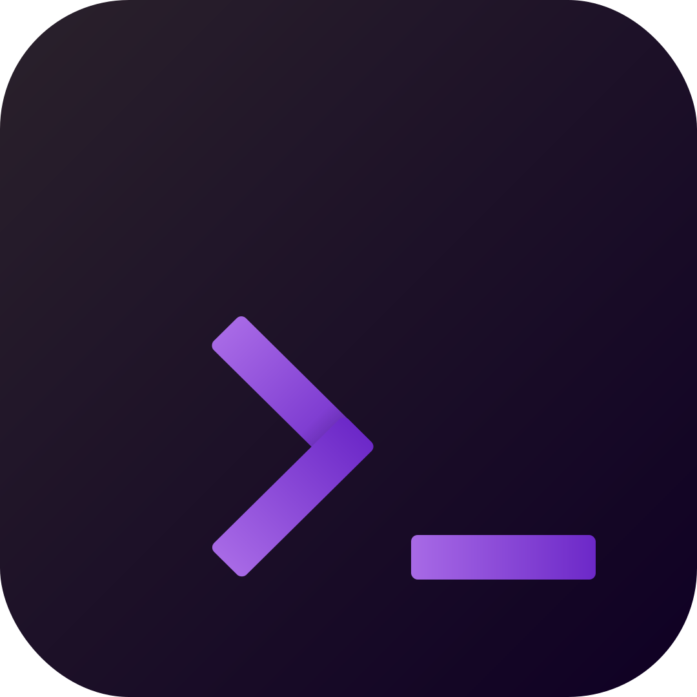

<p align="center"></p>
<h1 align="center">@tryforge/cli</h1>
<p align="center"><strong>The official CLI tool for building, managing and scaling <code>ForgeScript</code> projects</strong></p>
<p align="center">
  <a href="https://www.npmjs.com/package/@tryforge/cli">
    
  </a>
  <a href="https://github.com/tryforge/CLI/"></a>
  
</p>

## ✨ What is ForgeCLI?

> `@tryforge/cli` is a powerful and user-friendly Command Line Interface that helps developers bootstrap, organize, and maintain **ForgeScript** projects — the scripting language used in [BotForge](https://botforge.dev).
> Whether you're starting a new bot, organizing scripts, running tests, or releasing a package, ForgeCLI has your back.

## 🚀 Features

- 📦 **Project Bootstrapping** - Quickly scaffold new ForgeScript projects with `forge init`
- 📁 **Smart Scaffolding** - Generate files and folders with proper structure using `forge generate`
- 🔁 **Script Preview & Testing** - Test your scripts locally before deployment
- 🧪 **Integrated Testing** - Run test suites with built-in test runner
- 🔐 **Secret Management** - Securely store and manage tokens and credentials for your projects
- 📜 **Metadata Extraction** - Automatically extract and manage project metadata
- 🧰 **Extensible Plugin System** - Add custom functionality with plugins and script packs
- 📡 **Intelligent Updates** - Check for updates with detailed version comparison
- 📄 **Documentation Generation** - Create beautiful docs in Markdown or HTML format
- ✅ **Typed Configuration** - Full TypeScript support with validation for your config files
- 🔄 **Hot Reloading** - Automatically reload your scripts during development
- 🚨 **Error Highlighting** - Clear error messages with syntax highlighting
- 🌐 **Cross-Platform** - Works on Windows, macOS, and Linux

## 📋 Prerequisites

- [Node.js](https://nodejs.org/) (v16.0.0 or higher)
- npm, yarn, or pnpm package manager

## 📦 Installation

> [!TIP]
> We recommend using pnpm for the best performance and disk space usage, but npm and yarn work great too!

```bash
# Using pnpm (recommended)
pnpm add -g @tryforge/cli

# Using npm
npm install -g @tryforge/cli

# Using yarn
yarn global add @tryforge/cli
```

You can verify your installation was successful by running:

```bash
forge --version
```

## 📖 Usage

```bash
forge <command> [...options]
```

### Available Commands

| Command          | Description                                          | Example                              |
| ---------------- | ---------------------------------------------------- | ------------------------------------ |
| `forge init`     | Scaffold a new ForgeScript project                   | `forge init my-bot`                  |
| `forge generate` | Create scripts, modules, configs, etc.               | `forge generate script moderation`   |
| `forge run`      | Run a script locally with context                    | `forge run ./scripts/welcome.forge`  |
| `forge version`  | Show current CLI version & check updates             | `forge version --check`              |
| `forge test`     | Run tests in `__tests__/` directory                  | `forge test`                         |
| `forge clean`    | Delete build artifacts and metadata                  | `forge clean`                        |
| `forge config`   | Edit or validate CLI configuration                   | `forge config validate`              |
| `forge doc`      | Generate documentation (HTML/Markdown)               | `forge doc --output docs`            |
| `forge watch`    | Watch for changes and auto-reload                    | `forge watch ./scripts`              |
| `forge build`    | Build your project for production                    | `forge build`                        |
| `forge plugin`   | Manage plugins for your ForgeScript project          | `forge plugin install @forge/logger` |
| `forge secrets`  | Manage tokens and secrets                            | `forge secrets set BOT_TOKEN`        |

> [!NOTE]
> Run `forge help <command>` to see detailed usage information for any command.

## 🛠️ Detailed Command Usage

### `forge init`

Initialize a new ForgeScript project with all the necessary files and structure.

```bash
forge init [project-name] [options]
```

Options:
- `--template <name>` - Use a specific template (basic, discord, slash, etc.)
- `--package-manager <npm|yarn|pnpm>` - Specify your preferred package manager
- `--typescript` - Set up the project with TypeScript support
- `--git` - Initialize a git repository

Examples:
```bash
# Create a basic project
forge init my-cool-bot

# Create a Discord bot project with TypeScript
forge init discord-bot --template discord --typescript

# Create a project with slash commands
forge init slash-commands --template slash
```

> [!TIP]
> The templates come with ready-to-use examples to help you get started quickly!

### `forge generate`

Generate new files and folders with proper structure for your project.

```bash
forge generate <type> <name> [options]
```

Available types:
- `script` - Create a new ForgeScript file
- `module` - Create a new module with bundled functionality
- `command` - Create a new command (with slash command support)
- `config` - Generate a configuration file
- `test` - Create a test file

Options:
- `--path <directory>` - Specify where to create the file
- `--template <name>` - Use a specific template for generation

Examples:
```bash
# Generate a basic script
forge generate script welcome

# Generate a moderation command
forge generate command ban --template moderation

# Generate a test for your welcome script
forge generate test welcome
```

### `forge run`

Run a ForgeScript file locally with simulated context.

```bash
forge run <script-path> [options]
```

Options:
- `--context <json-file>` - Provide a JSON file with context data
- `--variables <key=value>` - Set environment variables
- `--watch` - Watch for changes and reload automatically
- `--verbose` - Show detailed execution information

Examples:
```bash
# Run a script with basic information
forge run ./scripts/welcome.forge

# Run with specific context and watch for changes
forge run ./scripts/moderation.forge --context ./context/mod.json --watch

# Run with custom variables
forge run ./scripts/welcome.forge --variables "USER_ID=123456789"
```

> [!IMPORTANT]
> The `run` command creates a sandboxed environment that simulates the BotForge runtime, making testing much easier!

### `forge test`

Run tests for your ForgeScript project.

```bash
forge test [test-path] [options]
```

Options:
- `--watch` - Watch for changes and rerun tests
- `--verbose` - Show detailed test output
- `--coverage` - Generate test coverage report

Examples:
```bash
# Run all tests
forge test

# Run specific test file with watching
forge test ./__tests__/welcome.test.ts --watch

# Generate test coverage report
forge test --coverage
```

## 🧠 Project Structure

ForgeCLI creates and works with the following project structure:

```text
your-forge-project/
├─ scripts/               # ForgeScript files
│  ├─ commands/           # Command scripts
│  │  ├─ moderation/      # Grouped by category
│  │  └─ utilities/
│  ├─ events/             # Event handler scripts
│  └─ modules/            # Reusable script modules
├─ __tests__/             # Test files
│  ├─ commands/
│  └─ modules/
├─ configs/               # Configuration files
│  ├─ settings.json
│  └─ permissions.json
├─ templates/             # Custom templates for generation
├─ forge.config.ts        # ForgeCLI configuration
├─ package.json           # Project dependencies
└─ .forge/                # ForgeCLI internal files
   ├─ cache/              # Cache for faster operations
   ├─ metadata/           # Extracted project metadata
   └─ secrets/            # Encrypted secrets storage
```

> [!NOTE]
> This structure is customizable through the `forge.config.ts` file.

## ⚙️ Configuration

ForgeCLI uses a `forge.config.ts` (or `.js`) file in your project root for configuration.

### Sample Configuration

```typescript
// forge.config.ts
import { defineConfig } from '@tryforge/cli';

export default defineConfig({
  // Project information
  project: {
    name: 'my-awesome-bot',
    version: '1.0.0',
    description: 'A powerful Discord bot using ForgeScript',
  },
  
  // Scripts configuration
  scripts: {
    directory: './scripts',
    patterns: ['**/*.forge'],
    commands: './scripts/commands',
    events: './scripts/events',
  },
  
  // Testing configuration
  tests: {
    directory: './__tests__',
    patterns: ['**/*.test.ts'],
  },
  
  // Build configuration
  build: {
    outDir: './dist',
    minify: true,
    sourcemaps: true,
  },
  
  // Documentation configuration
  docs: {
    outDir: './docs',
    format: 'markdown',
    include: ['README.md', 'CONTRIBUTING.md'],
  },
  
  // Plugins configuration
  plugins: [
    '@forge/logger',
    ['@forge/database', { type: 'mongodb' }],
  ],
});
```

> [!TIP]
> Use TypeScript for your config to get full IntelliSense and validation!

## 🧪 Testing Your Scripts

ForgeCLI supports TypeScript-based tests for your ForgeScript files. Tests are stored in the `__tests__` directory by default.

### Example Test File

```typescript
// __tests__/welcome.test.ts
import { describe, test, expect } from '@tryforge/test-utils';
import { runForgeScript } from '@tryforge/cli/testing';

describe('Welcome Script', () => {
  test('should greet new members', async () => {
    const result = await runForgeScript('./scripts/welcome.forge', {
      event: 'guildMemberAdd',
      data: {
        member: {
          id: '123456789',
          user: {
            username: 'TestUser',
          },
        },
        guild: {
          id: '987654321',
          name: 'Test Server',
        },
      },
    });
    
    expect(result.success).toBe(true);
    expect(result.output).toContain('TestUser');
    expect(result.output).toContain('Test Server');
  });
});
```

Run your tests with:

```bash
forge test
```

## 🔐 Managing Secrets

ForgeCLI provides a secure way to manage tokens and secrets for your ForgeScript projects.

```bash
# Set a secret
forge secrets set BOT_TOKEN

# List all secrets (names only, not values)
forge secrets list

# Use a secret in your script
forge run ./scripts/bot.forge --with-secrets
```

> [!CAUTION]
> Never commit your `.forge/secrets` directory to version control. It's automatically added to `.gitignore` for your protection.

## 📄 Generating Documentation

ForgeCLI can generate documentation for your ForgeScript project in both Markdown and HTML formats.

```bash
# Generate Markdown documentation
forge doc --format markdown --output ./docs

# Generate HTML documentation
